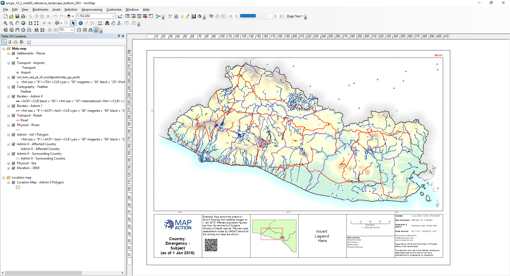

# MapChef

Master branch [](https://travis-ci.org/mapaction/mapactionpy_arcmap) [](https://coveralls.io/github/mapaction/mapactionpy_arcmap?branch=master)

Adds geospatial data to an ArcMap MXD file based on a recipe from a cookbook configuration file and a product name.

### Prerequisites

Python and ArcPy

```
C:\Python27\ArcGIS10.6\python.exe
```

## Packaging

```python setup.py bdist_wheel```

## Installing

```
python -m pip install jsonpickle
```

To install for development purposes:
Clone the github repo then from the root of your local clone:
```
python -m pip install --user -e .
```

To install for use non-development purposes:
Clone the github repo then from the root of your local clone:
```
python -m pip install .
```

todo:
[] enable installation via pypi.


## Configuration Files

### Cookbook File

The [mapCookbook.json](mapactionpy_arcmap/Config/mapCookbook.json) file is a static configuration file which contains "recipes" for each map product.

This example cookbook only contains a single product: ```Country Overview```.
```
{
  "recipes": [
    {
      "product": "Country Overview",
      "classification": "Core",
      "layers": [
        "mainmap-s0-pt-settlements",
        "mainmap-s0-pt-airports",
        "mainmap-s0-pt-seaports",
        "mainmap-s0-py-feather",
        "Borders - Admin 0",
        "mainmap-s1-ln-admin1",
        "mainmap-s0-ln-roads",
        "mainmap-s0-ln-rail",
        "mainmap-s0-py-waterbodies",
        "mainmap-s0-ln-rivers",
        "mainmap-s0-py-admin1",
        "mainmap-s0-py-affectedcountry",
        "mainmap-s0-py-surroundingcountries",
        "mainmap-s0-py-sea",
        "mainmap-s0-ras-dem",
        "mainmap-s0-ras-hillshade",
        "Location Map - Admin 0 Polygon"
      ]
    }
  ]
}
```

The layer names in the "```layers```" array MUST correlate to layer files (```.lyr```) in the specified layer directory.

### layerConfig File

The Layer Config file ([layerProperties.json](mapactionpy_arcmap/Config/layerProperties.json)) is a static file which defines how to add a particular layer.

```
    {
      "MapFrame": "Main Map",
      "LayerName": "mainmap-s0-pt-settlements",
      "RegExp": "^[a-z]{3}_stle_stl_pt_(.*?)_(.*?)_([phm][phm])(.*?).shp$",
      "DefinitionQuery": "place IN ('national_capital', 'city', 'capital')",
      "Display": "Yes",
      "LabelClasses": [
        {
          "className": "National Capital",
          "expression": "[name]",
          "SQLQuery": "(\"place\" = 'national_capital')"
        },
        {
          "className": "Admin 1 Capital",
          "expression": "[name]",
          "SQLQuery": "(\"place\" = 'city')"
        }
      ]
    },
```

#### Fields   
#|Field | Description|
-|------------ | -------------|
1|```MapFrame``` | Name of the Map Frame that the layer is to be added to|
2|```LayerName``` | Name of the Layer.  This must correlate with the ```layerFile.Name``` field in the ```mapCookbook.json``` file.  |
3|```RegExp``` | Regular Expression.  Used when selecting files to display|
4|```DefinitionQuery``` | Definition Query|
5|```Display``` | Shows if set to 'Yes'|
6|```LabelClasses``` | Details for displaying labels|

## Execution

### Parameters

#|Field | Description|
-|------------ | -------------|
1|```--cookbook`` | Path to the cookbook ```mapCookbook.json``` file.|
2|```--layerConfig``` | Path to the ```layerProperties.json``` file.|
3|```--cmf``` | Path to the Crash Move Folder root. |
4|```--template``` | Path to the ```MXD``` file.|
5|```--product``` | Name of product (must correlate with a product in the cookbook file). |
6|```--country``` | Name of country. |

### Example

```
C:\Python27\ArcGIS10.6\python.exe main.py \
   --cookbook "D:\MapAction\2019-06-25 - Automation - El Salvador\GIS\3_Mapping\31_Resources\31A_Automation\mapCookbook.json" \ 
   --layerConfig "C:\Users\steve\Source\Repos\mapactionpy_arcmap\poc\MapChef\Config\layerProperties.json" \
   --cmf "D:\MapAction\2019-06-25 - Automation - El Salvador" \ 
   --template "D:\MapAction\2019-06-25 - Automation - El Salvador\GIS\3_Mapping\32_MXD_Templates\arcgis_10_2\MapAction\01 Reference mapping\arcgis_10_2_ma000_reference_landscape_bottom_DEV.mxd" \
   --product "Country Overview" \
   --country "El Salvador"
```

### Result

This ```Country Overview``` map was generated:



## Integration with MapAction Toolbar

In order to integrate this `MapActionPy_ArcMap` module with the MapAction Toolbar, the following steps need to be carried out:

:information_source: The "Automation" add-in is in development in the `automation` branch at: https://github.com/mapaction/mapaction-toolbox/tree/automation):

1) All layer `.lyr` files should be made available under the crash move folder at the following location:
`\GIS\3_Mapping\31_Resources\312_Layer_files`
2) Layer properties file [layerProperties.json](mapactionpy_arcmap/Config/layerProperties.json) copied to new directory under the crash move folder at the following location:
`\GIS\3_Mapping\31_Resources\31A_Automation`
3) Map cookbook file [mapCookbook.json](mapactionpy_arcmap/Config/mapCookbook.json) copied to directory under the crash move folder at the following location:
`\GIS\3_Mapping\31_Resources\31A_Automation`


## Authors

* **Steve Hurst** - [https://github.com/mapaction/mapactionpy_arcmap](https://github.com/mapaction/mapactionpy_arcmap)

