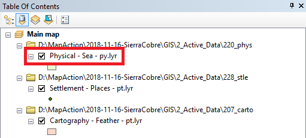
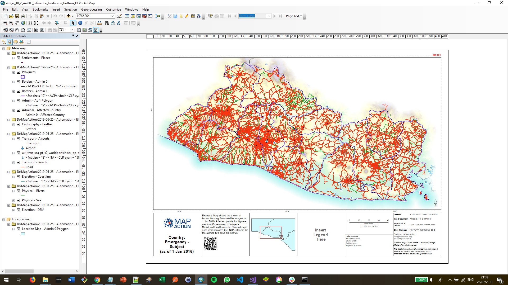

# MapChef

Adds geospatial data to an ArcMap MXD file based on a recipe from a cookbook configuration file and a product name.

### Prerequisites

Python and ArcPy

```
C:\Python27\ArcGIS10.6\python.exe
```

## Configuration Files

### layerConfig File

The Layer Config file ([layerProperties.json](Config/layerProperties.json)) is a static file which defines how to add a particular layer.

```
    {
      "MapFrame": "Main Map",
      "LayerGroup": "Elevation",
      "LayerName": "Physical - Sea - py",
      "SourceFolder": "220_phys",
      "RegExp": "^[a-z]{3}_phys_ocn_py_(.*?).shp$",
      "DefinitionQuery": "None",
      "Display": "Yes"
    },
```

#### Fields   
#|Field | Description|
-|------------ | -------------|
1|```MapFrame``` | Name of the Map Frame that the layer is to be added to|
2|```LayerGroup``` | Layer Group (:warning: NOT CURRENTLY IN USE)|
3|```LayerName``` | Name of the Layer.  This must correlate with the ```layerFile.Name``` field in the ```recipe.json``` file.  |
4|```SourceFolder``` | Folder under the &lt;root&gt;```/GIS/2_Active_Data``` directory|
5|```RegExp``` | Regular Expression.  Used when selecting files to display|
6|```DefinitionQuery``` | Definition Query|
7|```Display``` | Shows if set to 'Yes'|


##### Progress
:warning: Not all the Regular expressions in the [layerProperties.json](Config/layerProperties.json) file "work".  These will be updated in due course.<br>
:warning: Only shapefiles and rasters are handled in this version.


#|Tested|MapFrame|LayerGroup|LayerName|SourceFolder|RegExp|DefinitionQuery|Display||
-|-|--------|----------|---------|------------|------|---------------|-------|-|
1|:heavy_check_mark:|Main Map|None|Settlement - Places - pt|228_stle|^[a-z]{3}_stle_stl_pt_(.*?)_(.*?)_([phm][phm]).shp$|fclass IN ('national_capital', 'city')|Yes||
2||Main Map|Transport Points|Transport - Airports - pt|232_tran|^[a-z]{3}_tran_air_pt_(.*?)_(.*?)_([phm][phm]).shp$||Yes||
3||Main Map|Transport Points|Transport - Seaports - pt|232_tran|^[a-z]{3}_trans_por_pt_(.*?)_(.*?)_([phm][phm]).shp$||Yes||
4||Main Map|Elevation - Coastline - ln|Settlement - Places - pt|211_elev|^[a-z]{3}_elev_cst_ln_(.*?)_(.*?)_([phm][phm]).shp$||Yes||
5||Main Map|Admin Lines|Borders - Admin1 - ln|202_admn|^[a-z]{3}_admn_ad1_ln_(.*?)_(.*?)_([phm][phm]).shp$||Yes||
6||Location Map|Admin Lines|Borders - Admin2 - ln|202_admn|^[a-z]{3}_admn_ad2_ln_(.*?)_(.*?)_([phm][phm]).shp$||Yes||
7||Main Map|Transport Lines|Transport - Rail - ln|232_tran|^[a-z]{3}_tran_rrd_ln_(.*?)_(.*?)_([phm][phm]).shp$||Yes||
8||Main Map|Transport Lines|Transport - Road - ln|232_tran|^[a-z]{3}_tran_rds_ln_(.*?)_(.*?)_([phm][phm]).shp$||Yes||
9|:heavy_check_mark:|Main Map|None|Cartography - Feather - pt|207_carto|^[a-z]{3}_carto_fea_py_(.*?)_(.*?)_pp_(.*?).shp$||Yes||
10||Main Map|Physical|Physical - Waterbody - py|221_phys|||Yes||
11||Main Map|Physical|Physical - River - ln|221_phys|^[a-z]{3}_phys_riv_ln_(.*?)_(.*?)_([phm][phm]).shp$||Yes||
12||Main Map|Admin Polygons|Admin - Admin2 - py|202_admn|^[a-z]{3}_admn_ad2_py_(.*?)_(.*?)_([phm][phm]).shp$||Yes||
13||Main Map|Admin Polygons|Admin - Admin1 - py|202_admn|^[a-z]{3}_admn_ad1_py_(.*?)_(.*?)_([phm][phm]).shp$||Yes||
14||Main Map|Admin Polygons|Admin - AffectedCountry - py|202_admn|^[a-z]{3}_admn_ad0_py_(.*?)_(.*?)_([phm][phm]).shp$||Yes||
15||Main Map|Admin Polygons|Admin - SurroundingCountry - py|202_admn|^(?!(XXX))_admn_ad0_py_(.*?)_(.*?)_([phm][phm])(_(.+))||Yes||
16|:heavy_check_mark:|Main Map|Elevation|Physical - Sea - py|220_phys|^[a-z]{3}_phys_ocn_py_(.*?).shp$||Yes||
17|:heavy_check_mark:|Main Map|Elevation|Elevation - DEM - ras|211_elev|^Rasters.gdb\/[a-z]{3}_elev_dem_ras_(.*?)$||Yes||
18||Main Map|Elevation|Elevation - Hillshade - ras|211_elev|^Rasters.gdb\/[a-z]{3}_elev_hsh_ras_(.*?)$||Yes||
19||Main Map|Elevation|Elevation - Curvature - ras|211_elev|tbd||Yes||
20||Main Map|Legend|Legend - Road - ln|232_tran|^XXX_tran_rds_ln_(.*?)_(.*?)_([phm][phm])(_(.+))||No||
21||Main Map|Legend|Legend - WaterBody - py|221_phys|tbd||No||
22||Main Map|Legend|Elevation - Elevation - ras|211_elev|^XXX_elev_dem_ras_(.*?)_(.*?)_([phm][phm])(_(.+))||Yes||
23||Main Map|None|Location - Coastline - ln|211_elev|^XXX_elev_cst_ln_(.*?)_(.*?)_([phm][phm])(_(.+))||Yes||
24||Location Map|None|Location - Admin1 - ln|202_admn|^XXX_admn_ad1_ln_(.*?)_(.*?)_([phm][phm])(_(.+))||Yes||
25||Location Map|None|Location - AffectedCountry - py|202_admn|^XXX_admn_ad0_py_(.*?)_(.*?)_([phm][phm])(_(.+))||Yes||
26||Location Map|None|Location - SurroundingCountry - py|202_admn|^(?!(XXX))_admn_ad0_py_(.*?)_(.*?)_([phm][phm])(_(.+))||Yes||

After executing, the layers are generated and added to the MXD file, for example:


## Execution

### Parameters

#|Field | Description|
-|------------ | -------------|
1|```--cookbook`` | Path to the cookbook ```mapCookbook.json``` file.|
2|```--layerConfig``` | Path to the ```layerProperties.json``` file.|
3|```--cmf``` | Path to the Crash Move Folder root. |
4|```--template``` | Path to the ```MXD``` file.|
5|```--layerDirectory``` | Path to the Layer File directory. |
6|```--product``` | Name of product (must correlate with a product in the cookbook file). |

### Example

```
C:\Python27\ArcGIS10.6\python.exe main.py \
   --cookbook "D:\MapAction\2019-06-25 - Automation - El Salvador\GIS\3_Mapping\31_Resources\316_Automation\mapCookbook.json" \ 
   --layerConfig "C:\Users\steve\Source\Repos\mapactionpy_arcmap\poc\MapChef\Config\layerProperties.json" \
   --cmf "D:\MapAction\2019-06-25 - Automation - El Salvador" \ 
   --template "D:\MapAction\2019-06-25 - Automation - El Salvador\GIS\3_Mapping\32_MXD_Templates\arcgis_10_2\MapAction\01 Reference mapping\arcgis_10_2_ma000_reference_landscape_bottom_DEV.mxd" \
   --layerDirectory "D:\MapAction\2019-06-25 - Automation - El Salvador\GIS\3_Mapping\38_Initial_Maps_Layer_Files\All" \
   --product "Country Overview"
```

### Result

This ```Country Overview``` map was generated:



### File Types

The current implementation supports the following geospatial file types:

* Shape files       (.shp)
* TIF files         (.TIF)
* File Geodatabases (.gdb)

## Authors

* **Steve Hurst** - *Initial work* - [poc](https://github.com/mapaction/mapactionpy_arcmap/poc)

